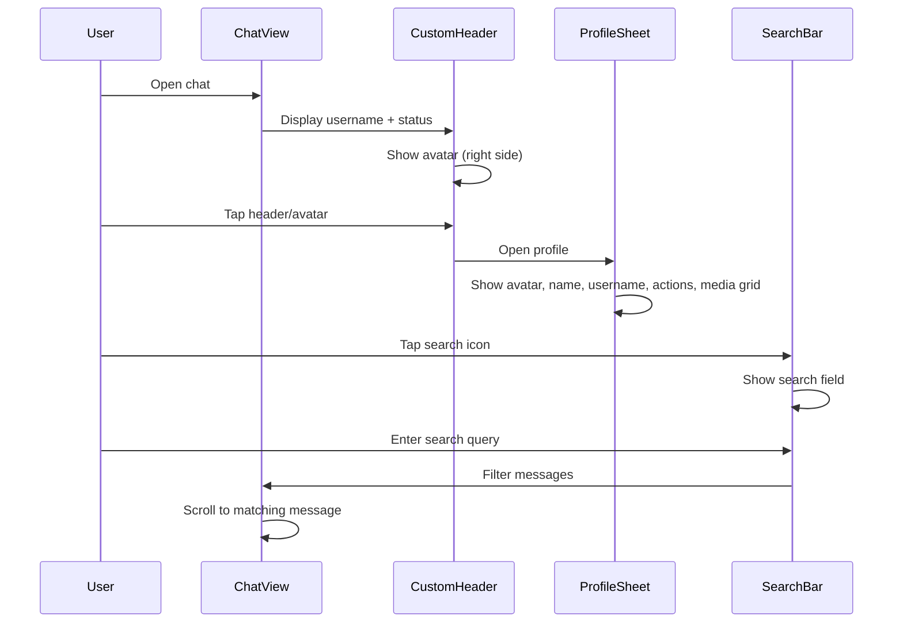
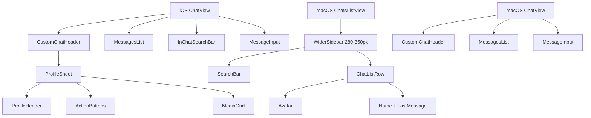

# Design Document: Telegram-Style Chat Improvements

## Overview

Transform the existing chat UI to match Telegram's quality with custom headers, profile access, in-chat search, and improved macOS sidebar. The iOS version will feature a custom navigation header with username/status display and avatar, tappable to open profile. The macOS version will have a wider sidebar (280-350px) with proper chat list layout including avatars, names, and last messages.

## Main Algorithm/Workflow



## Architecture



## Components and Interfaces

### iOS: CustomChatHeader

**Purpose**: Display username with status below and avatar on the right, tappable to open profile

**Interface**:
```swift
struct CustomChatHeader: View {
    let otherUser: Identity
    let isOnline: Bool
    @Binding var showProfile: Bool
    
    var body: some View
}
```

**Responsibilities**:
- Display username centered with status below ("в сети" or "был(а) недавно")
- Show avatar on the right side
- Handle tap gesture to open profile sheet
- Update online status in real-time

### iOS: InChatSearchBar

**Purpose**: Search within chat messages and scroll to results

**Interface**:
```swift
struct InChatSearchBar: View {
    @Binding var searchText: String
    @Binding var isSearching: Bool
    let onSearchResultTap: (ChatMessage) -> Void
    
    var body: some View
}
```

**Responsibilities**:
- Show/hide search field with animation
- Filter messages based on search query
- Display search results count
- Navigate between search results
- Scroll to selected result

### iOS: ProfileSheet

**Purpose**: Display user profile with avatar, info, actions, and media grid

**Interface**:
```swift
struct ProfileSheet: View {
    let user: Identity
    @Binding var isPresented: Bool
    
    var body: some View
}
```

**Responsibilities**:
- Display large avatar at top
- Show name and username
- Provide action buttons (call, mute, search, etc.)
- Display media grid (photos/videos from chat)
- Handle profile actions

### macOS: WiderChatsListView

**Purpose**: Wider sidebar (280-350px) with proper chat list layout

**Interface**:
```swift
struct WiderChatsListView: View {
    @EnvironmentObject var authViewModel: AuthViewModel
    @State private var chats: [ChatListItem] = []
    @State private var searchText: String = ""
    @Binding var selectedChatId: String?
    
    var body: some View
}
```

**Responsibilities**:
- Display wider sidebar (280-350px instead of narrow)
- Show search bar at top
- List chats with avatar + name + last message
- Handle chat selection
- Support swipe actions and context menu

### macOS: ImprovedChatListRow

**Purpose**: Enhanced chat row with avatar, name, and last message preview

**Interface**:
```swift
struct ImprovedChatListRow: View {
    let chat: ChatListItem
    
    var body: some View
}
```

**Responsibilities**:
- Display circular avatar (48x48)
- Show username prominently
- Display last message preview (truncated)
- Show timestamp
- Indicate unread status (if applicable)

## Data Models

### OnlineStatus

```swift
enum OnlineStatus {
    case online
    case offline(lastSeen: Date)
    
    var displayText: String {
        switch self {
        case .online:
            return "в сети"
        case .offline(let lastSeen):
            return formatLastSeen(lastSeen)
        }
    }
    
    private func formatLastSeen(_ date: Date) -> String {
        // Returns "был(а) недавно", "был(а) вчера", etc.
    }
}
```

**Validation Rules**:
- lastSeen must be in the past
- online status should be updated in real-time

### SearchResult

```swift
struct SearchResult: Identifiable {
    let id: String
    let message: ChatMessage
    let matchRange: Range<String.Index>
    
    var highlightedText: AttributedString
}
```

**Validation Rules**:
- matchRange must be within message text bounds
- message must exist in current chat

### MediaItem

```swift
struct MediaItem: Identifiable {
    let id: String
    let type: MediaType
    let url: URL
    let thumbnail: URL?
    let createdAt: Date
}

enum MediaType {
    case photo
    case video
}
```

**Validation Rules**:
- url must be valid
- type must match actual media content
- thumbnail required for videos

## Key Functions with Formal Specifications

### Function 1: toggleSearch()

```swift
func toggleSearch()
```

**Preconditions:**
- ChatView is visible and active
- Messages are loaded

**Postconditions:**
- `isSearching` state is toggled
- Search bar appears/disappears with animation
- If closing search: `searchText` is cleared and message list returns to normal scroll position

**Loop Invariants:** N/A

### Function 2: filterMessages()

```swift
func filterMessages(query: String, messages: [ChatMessage]) -> [SearchResult]
```

**Preconditions:**
- `query` is non-empty string
- `messages` array is valid (may be empty)

**Postconditions:**
- Returns array of SearchResult objects
- Each result contains message matching query (case-insensitive)
- Results are ordered by message timestamp (oldest first)
- Empty array if no matches found

**Loop Invariants:**
- For search loop: All previously checked messages remain in original order

### Function 3: scrollToMessage()

```swift
func scrollToMessage(messageId: String, proxy: ScrollViewProxy)
```

**Preconditions:**
- `messageId` exists in current messages array
- `proxy` is valid ScrollViewProxy instance
- ScrollView is rendered and ready

**Postconditions:**
- ScrollView scrolls to message with given ID
- Message is highlighted temporarily (2 seconds)
- Scroll animation completes smoothly

**Loop Invariants:** N/A

### Function 4: loadMediaItems()

```swift
func loadMediaItems(chatId: String) async throws -> [MediaItem]
```

**Preconditions:**
- `chatId` is valid and non-empty
- User has permission to access chat
- Network connection is available

**Postconditions:**
- Returns array of MediaItem objects from chat
- Items are sorted by creation date (newest first)
- Only photo and video types are included
- Throws error if network fails or unauthorized

**Loop Invariants:**
- For message iteration: All processed messages have valid media URLs

## Algorithmic Pseudocode

### Main Search Algorithm

```swift
// ALGORITHM: In-Chat Message Search
// INPUT: searchQuery (String), messages ([ChatMessage])
// OUTPUT: searchResults ([SearchResult])

func performSearch(query: String, messages: [ChatMessage]) -> [SearchResult] {
    // ASSERT: query is non-empty
    guard !query.isEmpty else { return [] }
    
    var results: [SearchResult] = []
    let lowercasedQuery = query.lowercased()
    
    // Step 1: Iterate through all messages
    // LOOP INVARIANT: All processed messages have been checked for matches
    for message in messages {
        let content = message.encryptedContent.lowercased()
        
        // Step 2: Find all occurrences of query in message
        var searchStartIndex = content.startIndex
        
        while searchStartIndex < content.endIndex,
              let range = content.range(of: lowercasedQuery, 
                                       range: searchStartIndex..<content.endIndex) {
            
            // Step 3: Create search result with match range
            let result = SearchResult(
                id: "\(message.id)_\(range.lowerBound)",
                message: message,
                matchRange: range
            )
            results.append(result)
            
            // Move to next potential match
            searchStartIndex = range.upperBound
        }
    }
    
    // ASSERT: All messages have been searched
    // ASSERT: Results are in chronological order (same as messages array)
    return results
}
```

**Preconditions:**
- query is non-empty string
- messages array is valid and sorted by timestamp

**Postconditions:**
- Returns all matching results
- Results maintain chronological order
- Each result has valid matchRange within message content

**Loop Invariants:**
- Outer loop: All previously checked messages have been fully searched
- Inner loop: All previous occurrences in current message have been found

### Profile Sheet Display Algorithm

```swift
// ALGORITHM: Display User Profile with Media
// INPUT: user (Identity), chatId (String)
// OUTPUT: ProfileSheet view with media grid

func displayProfile(user: Identity, chatId: String) async {
    // Step 1: Show profile sheet with basic info
    showProfileSheet = true
    
    // Step 2: Load media items asynchronously
    // ASSERT: chatId is valid
    isLoadingMedia = true
    
    do {
        // Step 3: Fetch media from backend
        let mediaItems = try await loadMediaItems(chatId: chatId)
        
        // Step 4: Filter and sort media
        // LOOP INVARIANT: All processed items are valid media types
        let filteredMedia = mediaItems.filter { item in
            item.type == .photo || item.type == .video
        }.sorted { $0.createdAt > $1.createdAt }
        
        // Step 5: Update UI with media grid
        await MainActor.run {
            self.mediaItems = filteredMedia
            self.isLoadingMedia = false
        }
        
        // ASSERT: mediaItems contains only photos and videos
        // ASSERT: mediaItems are sorted newest first
    } catch {
        // Step 6: Handle error gracefully
        await MainActor.run {
            self.mediaItems = []
            self.isLoadingMedia = false
            self.showError = true
        }
    }
}
```

**Preconditions:**
- user is valid Identity object
- chatId exists and user has access
- Network connection available

**Postconditions:**
- Profile sheet is displayed
- Media items are loaded and displayed (or empty state shown)
- Loading state is properly managed
- Errors are handled gracefully

**Loop Invariants:**
- All filtered media items are valid photo or video types
- Sort order is maintained throughout processing

### Sidebar Width Adjustment Algorithm (macOS)

```swift
// ALGORITHM: Adjust Sidebar Width for Better UX
// INPUT: currentWidth (CGFloat), targetWidth (CGFloat)
// OUTPUT: Animated width transition

func adjustSidebarWidth(to targetWidth: CGFloat) {
    // ASSERT: targetWidth is between 280 and 350
    guard (280...350).contains(targetWidth) else { return }
    
    // Step 1: Calculate animation duration based on distance
    let distance = abs(targetWidth - currentWidth)
    let duration = min(0.3, distance / 1000)
    
    // Step 2: Animate width change
    withAnimation(.easeInOut(duration: duration)) {
        sidebarWidth = targetWidth
    }
    
    // Step 3: Save preference
    UserDefaults.standard.set(targetWidth, forKey: "sidebarWidth")
    
    // ASSERT: sidebarWidth is within valid range
    // ASSERT: Animation is smooth and responsive
}
```

**Preconditions:**
- targetWidth is between 280 and 350 pixels
- View is rendered and ready for animation

**Postconditions:**
- Sidebar width is updated to targetWidth
- Animation completes smoothly
- User preference is saved
- Layout adjusts without breaking

**Loop Invariants:** N/A

## Example Usage

### iOS: Custom Header with Profile Access

```swift
// Example 1: ChatView with custom header
struct ChatView: View {
    @State private var showProfile = false
    @State private var isOnline = false
    
    var body: some View {
        VStack(spacing: 0) {
            CustomChatHeader(
                otherUser: otherUser,
                isOnline: isOnline,
                showProfile: $showProfile
            )
            
            MessagesList(messages: messages)
            MessageInput(text: $messageText, onSend: sendMessage)
        }
        .sheet(isPresented: $showProfile) {
            ProfileSheet(user: otherUser, isPresented: $showProfile)
        }
    }
}

// Example 2: In-chat search
struct ChatView: View {
    @State private var isSearching = false
    @State private var searchText = ""
    @State private var searchResults: [SearchResult] = []
    
    var body: some View {
        VStack {
            if isSearching {
                InChatSearchBar(
                    searchText: $searchText,
                    isSearching: $isSearching,
                    onSearchResultTap: { result in
                        scrollToMessage(messageId: result.message.id)
                    }
                )
            }
            
            MessagesList(messages: filteredMessages)
        }
        .toolbar {
            ToolbarItem(placement: .navigationBarTrailing) {
                Button(action: { isSearching.toggle() }) {
                    Image(systemName: "magnifyingglass")
                }
            }
        }
    }
    
    var filteredMessages: [ChatMessage] {
        if searchText.isEmpty {
            return messages
        }
        return performSearch(query: searchText, messages: messages)
            .map { $0.message }
    }
}
```

### macOS: Wider Sidebar with Improved Layout

```swift
// Example 3: macOS ChatsListView with wider sidebar
struct ContentView: View {
    @State private var selectedChatId: String?
    @State private var sidebarWidth: CGFloat = 320
    
    var body: some View {
        NavigationView {
            WiderChatsListView(selectedChatId: $selectedChatId)
                .frame(width: sidebarWidth)
            
            if let chatId = selectedChatId {
                ChatView(chatId: chatId, otherUser: selectedUser)
            } else {
                Text("Выберите чат")
                    .foregroundColor(.secondary)
            }
        }
    }
}

// Example 4: Improved chat list row
struct ImprovedChatListRow: View {
    let chat: ChatListItem
    
    var body: some View {
        HStack(spacing: 12) {
            // Avatar (48x48)
            AsyncImage(url: URL(string: chat.user.avatar)) { image in
                image.resizable()
            } placeholder: {
                Circle()
                    .fill(Color.gray.opacity(0.3))
                    .overlay(
                        Text(chat.user.username.prefix(2).uppercased())
                            .font(.system(size: 18, weight: .semibold))
                    )
            }
            .frame(width: 48, height: 48)
            .clipShape(Circle())
            
            VStack(alignment: .leading, spacing: 4) {
                HStack {
                    Text(chat.user.username)
                        .font(.system(size: 15, weight: .semibold))
                    
                    Spacer()
                    
                    Text(formatTime(chat.lastMessageDate))
                        .font(.system(size: 13))
                        .foregroundColor(.secondary)
                }
                
                Text(chat.lastMessage)
                    .font(.system(size: 13))
                    .foregroundColor(.secondary)
                    .lineLimit(1)
            }
        }
        .padding(.vertical, 8)
    }
}
```

## Correctness Properties

### Property 1: Search Results Accuracy
∀ query ∈ String, messages ∈ [ChatMessage]:
  let results = performSearch(query, messages)
  ⟹ ∀ result ∈ results: result.message.encryptedContent.contains(query, caseInsensitive: true)

### Property 2: Profile Sheet Data Consistency
∀ user ∈ Identity, chatId ∈ String:
  displayProfile(user, chatId) ⟹ profileSheet.user.id == user.id ∧ profileSheet.mediaItems.chatId == chatId

### Property 3: Sidebar Width Bounds (macOS)
∀ width ∈ CGFloat:
  adjustSidebarWidth(width) ⟹ sidebarWidth ∈ [280, 350]

### Property 4: Online Status Display
∀ user ∈ Identity:
  user.isOnline == true ⟹ statusText == "в сети"
  ∧ user.isOnline == false ⟹ statusText.contains("был(а)")

### Property 5: Message Scroll Integrity
∀ messageId ∈ String, messages ∈ [ChatMessage]:
  messageId ∈ messages.map(\.id) ⟹ scrollToMessage(messageId) scrolls to correct position

## Error Handling

### Error Scenario 1: Network Failure During Media Load

**Condition**: Network request fails while loading media items for profile
**Response**: Display empty media grid with "Не удалось загрузить медиа" message
**Recovery**: Provide retry button; cache previously loaded media

### Error Scenario 2: Invalid Search Query

**Condition**: User enters special characters or extremely long search query
**Response**: Sanitize input; limit query length to 100 characters
**Recovery**: Show warning if query is truncated; continue with valid portion

### Error Scenario 3: Message Not Found During Scroll

**Condition**: Attempting to scroll to message that no longer exists (deleted)
**Response**: Show toast: "Сообщение не найдено"
**Recovery**: Clear search and return to bottom of chat

### Error Scenario 4: Profile Data Unavailable

**Condition**: User profile cannot be loaded (deleted account, network error)
**Response**: Show basic profile with cached data; display error banner
**Recovery**: Retry button; fallback to minimal profile view

## Testing Strategy

### Unit Testing Approach

Test individual components in isolation:
- CustomChatHeader: Verify tap gesture triggers profile sheet
- InChatSearchBar: Test search filtering logic with various queries
- ProfileSheet: Verify media grid layout with different item counts
- ImprovedChatListRow: Test timestamp formatting and text truncation

Key test cases:
- Search with empty query returns all messages
- Search with no matches returns empty array
- Profile sheet displays correct user data
- Sidebar width stays within bounds (280-350px)

### Property-Based Testing Approach

**Property Test Library**: swift-check (or XCTest with randomized inputs)

Properties to test:
1. Search always returns subset of original messages
2. All search results contain the query string
3. Sidebar width adjustment always results in valid width
4. Message scroll always positions message in visible area
5. Media items are always sorted by date (newest first)

### Integration Testing Approach

Test complete user flows:
1. Open chat → tap header → view profile → close profile
2. Open chat → tap search → enter query → tap result → scroll to message
3. macOS: Select chat from sidebar → view messages → send message
4. Load profile → load media grid → tap media item → view full screen

## Performance Considerations

- Lazy loading for message list (use LazyVStack)
- Debounce search input (300ms delay) to avoid excessive filtering
- Cache media thumbnails locally to reduce network requests
- Virtualize media grid for profiles with many items
- Optimize sidebar rendering with list recycling
- Use AsyncImage with placeholder for smooth avatar loading

## Security Considerations

- Sanitize search queries to prevent injection attacks
- Validate media URLs before loading
- Ensure profile data access respects privacy settings
- Rate limit search requests to prevent abuse
- Verify user permissions before displaying profile
- Encrypt cached media items locally

## Dependencies

- SwiftUI (iOS 15+, macOS 12+)
- Combine (for reactive state management)
- AsyncImage (for avatar and media loading)
- URLSession (for API requests)
- UserDefaults (for sidebar width preference on macOS)
- Existing APIService for backend communication
- Existing Identity and ChatMessage models
